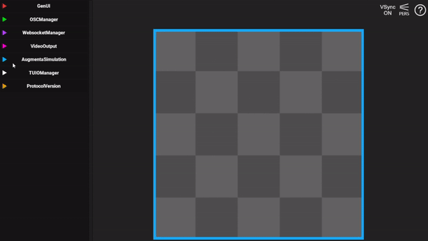
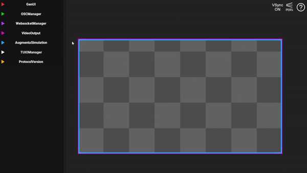
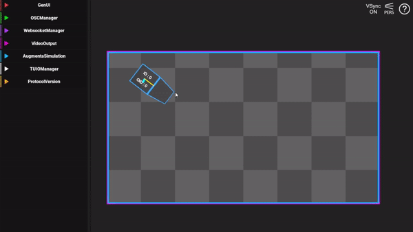
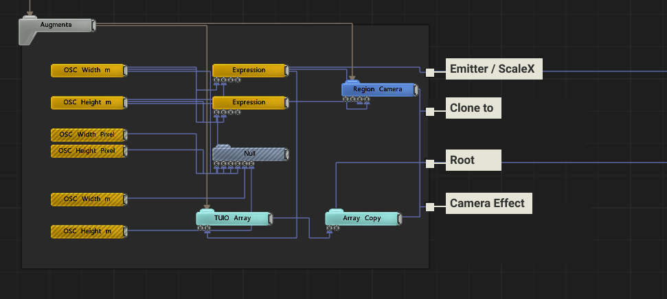
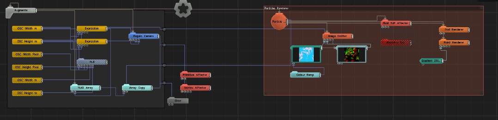

# Getting started with Notch

<figure><figcaption>
Example project using Augmenta in Resolume
</figcaption></figure>

 

<figure><figcaption>
Notch example in real condition
</figcaption></figure>

### Notch

[Notch ](https://www.notch.one/)is an amazing motion graphics and interactive VFX software. Trusted by the world’s biggest artists, brands and events, Notch is the first tool that enables you to create interactive and video content in one unified real-time environment.\
\
Create interactive and generative content and live video effects in a powerful, easy and stable workflow.

### Video Tutorial



This video shows how to open the example in Notch and how to set up Augmenta Fusion to send data to it.

## Written tutorial

Prerequisites:

* Having [Notch ](https://www.notch.one/support/downloads\_area/)installed on your computer
* Having [Augmenta simulator](https://augmenta.tech/downloads) installed on your computer

### Install

Download the Augmenta example here



### Use

#### Send data with Augmenta Simulator

Start Augmenta Simulator and setup your scene size (in meter)

For that go to : AugmentaSimulation / Scene settings / Width, Height&#x20;

Be careful, the ratio of the scene must be the same in Augmenta Simulator (in meter) and in Notch (in pixel)

<figure><figcaption></figcaption></figure>

Select the Notch preset in the TUIOManager / Output settings

<figure><figcaption></figcaption></figure>

Add points in Augmenta Simulator

Left click to add a point. Right click to remove a point.

You can change the behavior of the points in augmenta simulation.

<figure><figcaption></figcaption></figure>

#### Receive Data in Notch

(These steps are already setup in the example)

* Enable TUIO in your project : go to Project / Settings / Protocols
* Enter the TUIO receive port
* Enter OSC receive port

<figure><figcaption></figcaption></figure>

#### Set resolution viewport

(The example provided has a Spout and NDI video output)

* Project / Settings / Rendering : Output Width, Output Height

<figure><figcaption></figcaption></figure>

#### Augmenta Block

<figure><figcaption></figcaption></figure>

#### Create

Your are ready now to make your own creation with [Notch](https://www.notch.one/) and [Augmenta](https://www.augmenta-tech.com/) ! Enjoy and share it ;)

<figure><figcaption></figcaption></figure>
