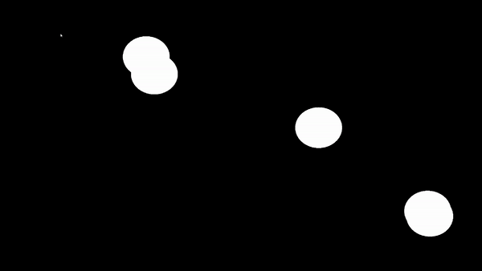

# Augmenta plugins for Notch

### Particles

<figure><figcaption></figcaption></figure>

### Simple example

<figure><figcaption>
Simple example
</figcaption></figure>

### \[advanced TD] External TUIO/OSC input from TouchDesigner


[notch-in-td.md](../notch-block-in-media-server/notch-in-td.md)


### \[advanced] External OSC input for embedded notch block
