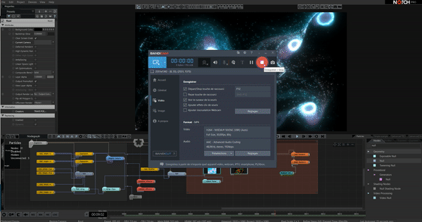

# Notch block in media server

### Export Notch block for media servers

You can export a Notch block to use it inside a media server ( Project / Compile Block for Media Server)

<figure><figcaption></figcaption></figure>

or download the Notch block here :

### Use Notch block in Media Server


[notch-in-td.md](notch-in-td.md)



[notch-in-disguise.md](notch-in-disguise.md)



[notch-in-smode.md](notch-in-smode.md)



[notch-in-lightact.md](notch-in-lightact.md)


### Limitation

Be careful that since we cannot expose or disable the Notch functionality, the ports 13000 and 13100 will still be bound and reserved by the Notch block.

> Receiving TUIO / OSC Data **INSIDE** the Notch block

The TUIO and OSC data will be received from the ports already defined in the Notch. (Default to TUIO : 13000 and OSC : 13100)

/!\ It is not possible to expose these ports values in the Notch block so it's not possible to change those ports (at the time of writing) !

> Receiving TUIO / OSC Data **OUTSIDE** the Notch block

The TUIO and OSC data will be received from the media server and then the resulting data (scene size and object position array) will be passed to the Notch block.

Note : This is useful when you intend to have several Augmenta Notch block in your media server composition. This workflow enables creating one OSC TUIO connection and pass the data to the different blocks instead of creating one connection per block.

* Touch Designer : [repo Github](https://github.com/Augmenta-tech/Notch-with-Data-in-TD)
